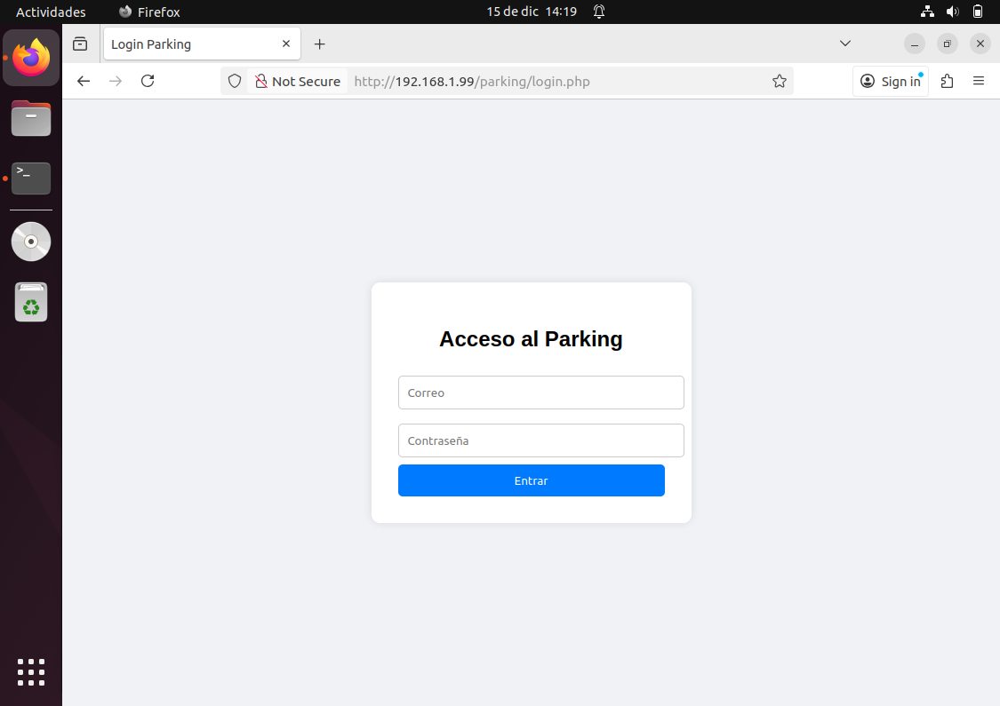
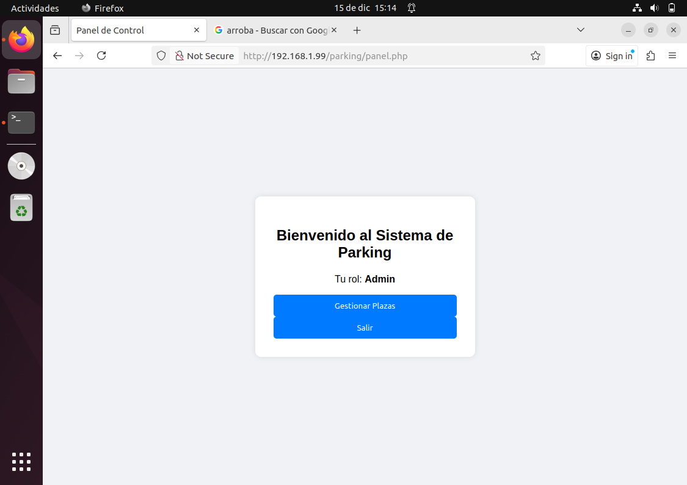
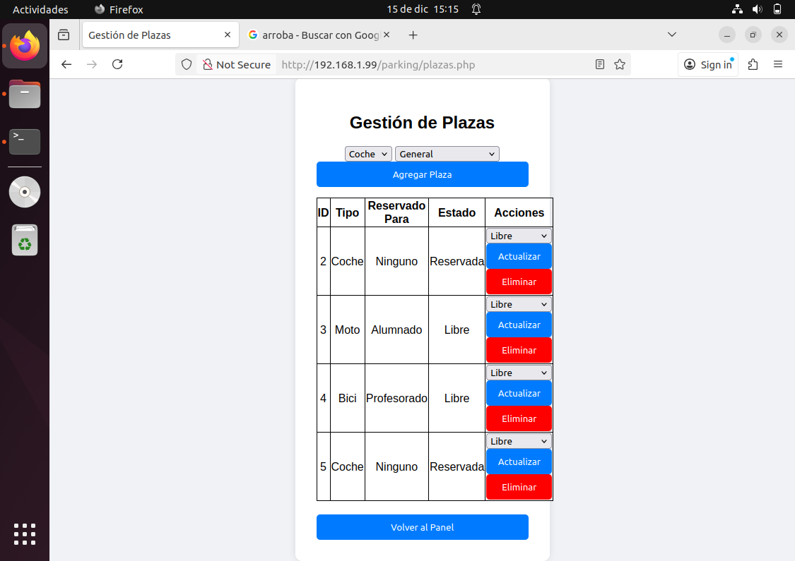
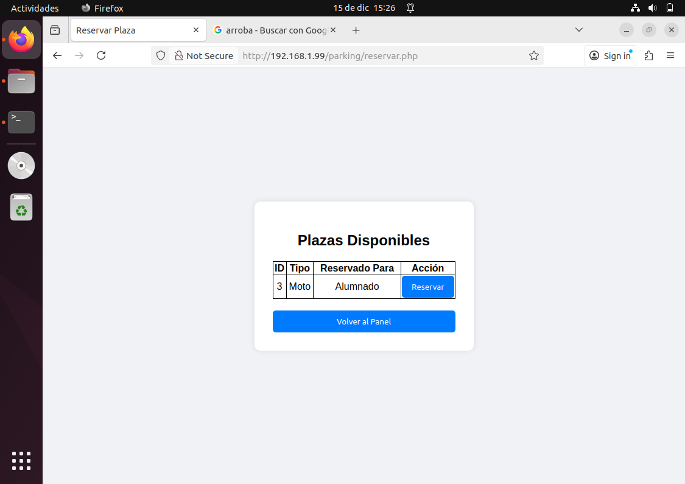
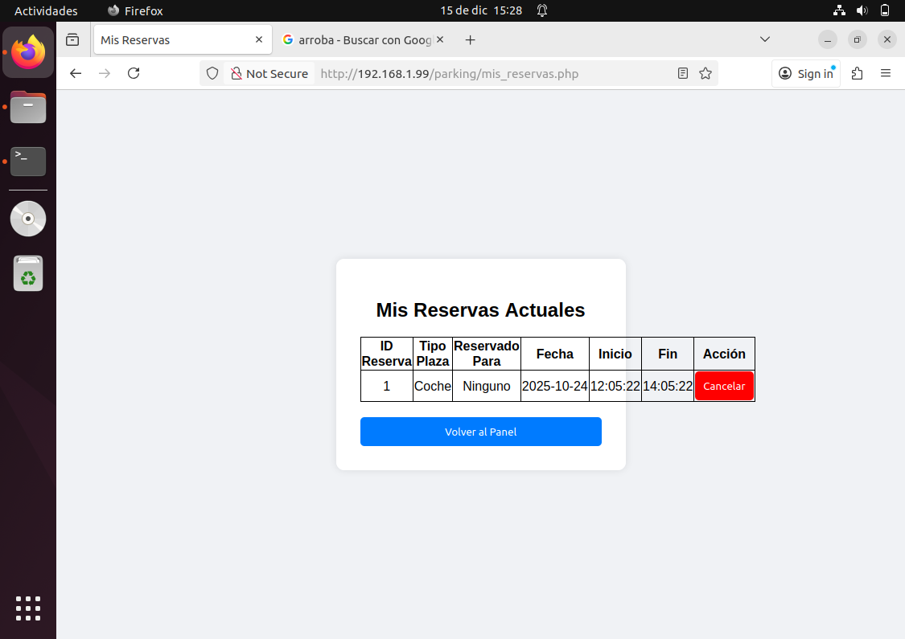
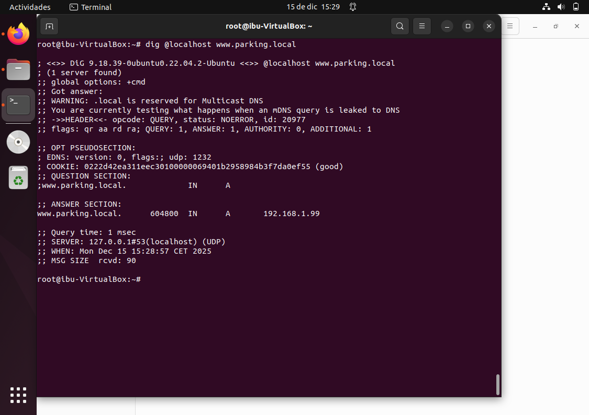
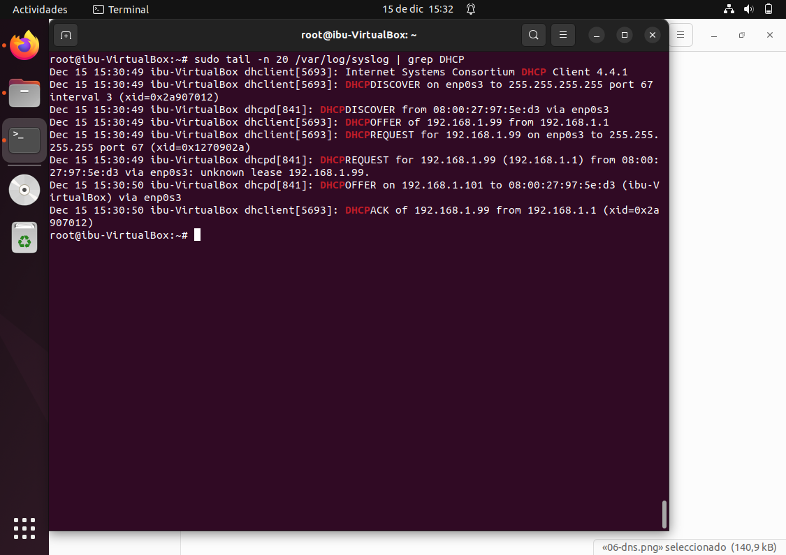
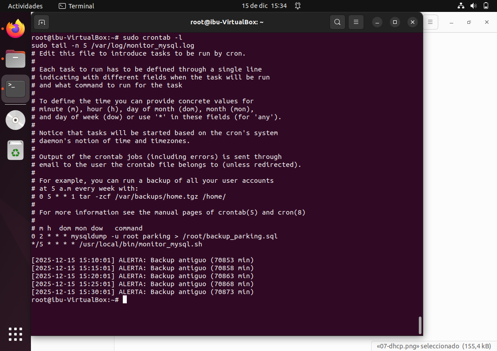

# Sistema de Gestión de Parking del Centro Educativo 🚗🏍️🚲

- **Nombre:** Ibou Laye Montero Lloret
- **Ciclo:** Administración de Sistemas Informáticos en Red (ASIR)

---

## Descripción
Aplicación web para la gestión del parking de un centro educativo. 
Permite administrar plazas de parking y realizar reservas según el rol del usuario 
(administrador, profesorado y alumnado), integrando servicios de red, base de datos, 
seguridad y automatización.

---

## Objetivos
- Gestionar plazas de parking (libre, reservada, ocupada).
- Diferenciar tipos de plazas (coche, moto, bicicleta).
- Control de acceso por roles.
- Reservar y cancelar plazas.
- Administrar la base de datos de forma segura.
- Implementar servicios DNS y DHCP.
- Automatizar copias de seguridad y monitorización.
- Aplicar medidas de seguridad y gestión de riesgos.

---

## Tecnologías utilizadas
- **Sistema Operativo:** Ubuntu Server 22.04 LTS
- **Virtualización:** Oracle VirtualBox
- **Servidor Web:** Apache2
- **Lenguaje:** PHP
- **Base de Datos:** MySQL
- **Servicios de Red:** Bind9 (DNS), ISC DHCP Server (DHCP)
- **Automatización:** Bash + Cron
- **Scripting:** Python 3
- **Control de versiones:** Git y GitHub

---

## Base de datos
La base de datos `parking` está compuesta por las siguientes tablas:
- `usuarios`
- `plazas`
- `reservas`

Incluye:
- **Vistas** para consulta de reservas.
- **Índices** para optimización de consultas.
- **Trigger** que actualiza automáticamente el estado de las plazas al realizar una reserva.

---

## Esquema E/R
El esquema Entidad/Relación del sistema se encuentra documentado en:

- `docs/er.txt`

Incluye las entidades **usuarios**, **plazas** y **reservas**, con sus relaciones y 
claves primarias y foráneas.

---

## Tutorial de uso

### 1. Acceso a la aplicación
El usuario accede a la aplicación mediante la pantalla de login.

---

### 2. Panel de administración
El administrador inicia sesión y accede al panel principal.

---

### 3. Gestión de plazas
Desde el panel de administración se pueden crear y visualizar plazas.

---

### 4. Reserva de plazas
Los usuarios pueden consultar las plazas disponibles y realizar una reserva.

---

### 5. Gestión de reservas
Cada usuario puede visualizar y cancelar sus reservas activas.

---

### 6. Servicio DNS
Comprobación del correcto funcionamiento del servicio DNS.

---

### 7. Servicio DHCP
Verificación de la asignación dinámica de direcciones IP mediante DHCP.

---

### 8. Backup y monitorización
El sistema cuenta con copias de seguridad automáticas y 
monitorización del estado del servicio MySQL.

---

## Despliegue
- Acceso a la aplicación:

  http://192.168.1.99/parking/
---

## Bitácora de tareas
La bitácora del proyecto se encuentra documentada en:

- `docs/bitacora.txt`
---

## Seguridad y Alta Disponibilidad
La documentación de seguridad del proyecto se encuentra en los siguientes archivos:

- `docs/seguridad_activos.txt`
- `docs/seguridad_amenazas.txt`
- `docs/seguridad_vulnerabilidades.txt`
- `docs/seguridad_riesgos.txt`
- `docs/seguridad_mitigacion.txt`
- `docs/seguridad_implementacion.txt`
- `docs/seguridad_monitorizacion.txt`
- `docs/seguridad_incidentes.txt`
---

## Automatización y monitorización
- Copias de seguridad automáticas de la base de datos mediante `mysqldump` y `cron`.
- Script de monitorización que verifica:
  - Estado del servicio MySQL.
  - Antigüedad de las copias de seguridad.
---

## Bibliografía
- Documentación oficial de Ubuntu
- Documentación oficial de MySQL
- Documentación oficial de Apache
- PHP.net
- Apuntes del ciclo ASIR

Archivo completo en:
- `docs/bibliografia.txt`
